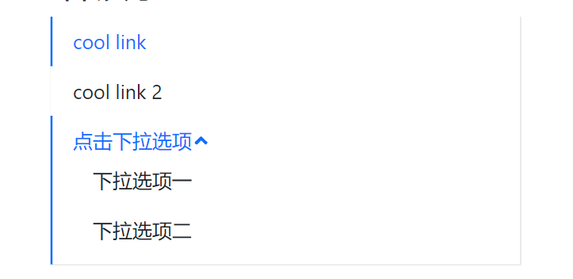

### 前置准备：

- 样式解决方案分析
  Inline CSS
  CSS in JS(style Component)
  Sass/Less(√)`npm install node-sass --save`

  - CSS样式重置（normalize.css)：处理浏览器样式的不同

  - 基础色彩系统

    创建自己组件库的色彩体系:详细见_variables.scss
    系统色板=基础色板（[中国色](http://zhongguose.com/)）+中性色板（只含有黑白灰）

    产品色板=品牌色（一般有两个颜色构成）+功能色

  - 字体系统

  - 表单系统

  - 按钮

  - 边框和阴影

- 组件需求分析与编码

- 组件测试用例分析和编码

- 代码打包输出与编译

- CI/CD,文档生成

### 组件测试：

通过在App.tsx中引入组件并引入进而观察是否生效有点过于低效，可以通过写测试让计算机运行，从而提高代码质量，更早发现BUG。

直接运行`npm run test`即可

通用测试框架[JEST](https://www.jestjs.cn/)，Create React-app自带。

使用：

- [断言](https://www.jestjs.cn/docs/using-matchers)：

  ```js
  test('two plus two is four', () => {
    expect(2 + 2).toBe(4);
  });
  ```

##### Reactce测试工具：（react-testing-library）(React自带)

使用示例：

```js
import React from 'react'
import { render } from '@testing-library/react'
import Button from './button'

test('our first react test case', () => {
  const wrapper = render(<Button>Nice</Button>) // render:添加到真实节点上去
  const element = wrapper.queryByText('Nice')
  expect(element).toBeTruthy()
})
```

安装jest-dom：添加新的断言

### 使用Storebook写文档


### 第一个组件BUTTON：

需求：


导入使用方法：

```jsx
<Button
    size="lg"
    type="primary"
    disabled
    href=""?// 要保证支持原生的属性
    className=""?
    autofocus=""?
    >test</Button>
```

添加className使用classnames

那么当要获取onClick事件是，怎么获取Button的类型属性

使用ts的交叉类型：可以将多个类型合并为一个类型

```js
// props
interface BaseButtonProps {
  className?: string;
  disabled?: boolean;
  size?: ButtonSize;
  btnType?: ButtonType;
  children: React.ReactNode;
  href?: string;
}
// 获取按钮的属性
type NativeButtonProps = BaseButtonProps & ButtonHTMLAttributes<HTMLElement>
// 获取a标签的属性并返回
type AnchorButtonProps = BaseButtonProps & AnchorHTMLAttributes<HTMLElement>
// Partial(属性可选)
export type ButtonProps = Partial<NativeButtonProps & AnchorButtonProps>
```

### 第二个组件Menu：

设计：

横向


纵向：



使用方式：

```js
<Menu 
defaultIndex='0'// 默认高亮的项
onSelect={(index) => {alert(index)}}// 点击执行回调
mode='horizontal'// 水平还是垂直
defaultOpenSubMenus={['2']}
>
  <MenuItem >
    cool Link
  </MenuItem>
  <MenuItem>
    cool Link1
  </MenuItem>
  <SubMenu title='dropdown'>
    <MenuItem>
      dropdown1
    </MenuItem>
    <MenuItem>
      dropdown2
    </MenuItem>
  </SubMenu>
</Menu>
```

问题：

- 把父组件的一些属性传递给子组件如`defaultIndex`、`onSelect`事件，可以使用Context来传递。

```tsx
interface IMenuContext {
  index: string;
  onSelect?: SelectCallBack;
  mode?: MenuMode;
  defaultOpenSubMenus?: string[];
}
export const MenuContext = createContext<IMenuContext>({index: '0'})
export const Menu: React.FC<MenuProps> = (props) => {
  const [ currentActive, setActive ] = useState(defaultIndex)
  const passedContext: IMenuContext = {
    index: currentActive ? currentActive : '0',
    onSelect: handleClick,
    mode,
    defaultOpenSubMenus
  }
  const renderChildren = () => {
    // 父组件操控children，直接用children.map可能会导致许多问题，因为children的数据结构是不确定的，
    return React.Children.map(children, (child, index) => {
      const childElement = child as React.FunctionComponentElement<MenuItemProps>
      const { displayName } = childElement.type
      if (displayName === 'MenuItem' || displayName === 'SubMenu') {
        return React.cloneElement(childElement, {
          index: index.toString()
        })
      } else {
        console.error('Warning: Menu has a Child which is not a MenuItem component')
      }
    })
  }
  return (
    <ul className={classes} style={style} data-testid='test-menu'>
      <MenuContext.Provider value={passedContext}>
        {renderChildren()}
      </MenuContext.Provider>
    </ul>
  )
}
// MenuItem.tsx
import { MenuContext } from './menu'
const MenuItem: React.FC<MenuItemProps> = (props) => {
    const context = useContext(MenuContext)
    const classes = classNames('menu-item', className, {
    'is-disabled': disabled,
    'is-active': context.index === index // 高亮
    })
    const handleClick = () => {
    if(context.onSelect && !disabled && (typeof index === 'string')) {
      context.onSelect(index)
    }
  }
  return (
    <li className={classes} style={style} onClick={handleClick}>
      {children}
    </li>
  )
}
```

- 多级index高亮

### 第三个组件ICON：

[icon图标库](https://fontawesome.com/v5.15/how-to-use/on-the-web/using-with/react)

```js
npm i --save @fortawesome/fontawesome-svg-core
npm install --save @fortawesome/free-solid-svg-icons
npm install --save @fortawesome/react-fontawesome
```

### 第四个组件Transition：

添加动画：

使用的组件动画库：
[react-transition-group](http://reactcommunity.org/react-transition-group/)

### 第五各组件Input


Stroybook:
npx -p @storybook/cli sb init
cnpm i -D @storybook/addon-info
cnpm i -save @types/storybook__addon-info

[Stroybook的下载安装：](https://storybook.js.org/docs/react/get-started/install)

```js
npx -p @storybook/cli sb init
```

