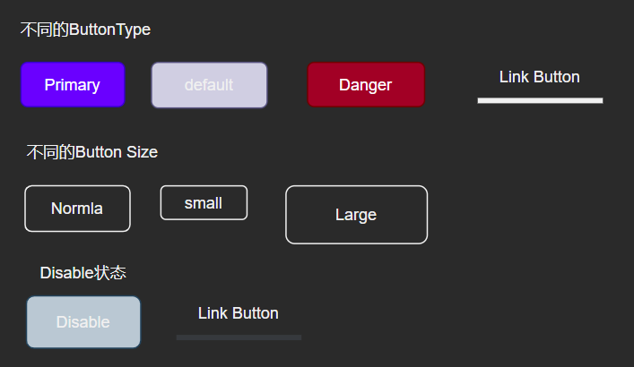

### 前置准备：

- 样式解决方案分析
  Inline CSS
  CSS in JS(style Component)
  Sass/Less(√)`npm install node-sass --save`

  - CSS样式重置（normalize.css)：处理浏览器样式的不同

  - 基础色彩系统

    创建自己组件库的色彩体系:详细见_variables.scss
    系统色板=基础色板（[中国色](http://zhongguose.com/)）+中性色板（只含有黑白灰）

    产品色板=品牌色（一般有两个颜色构成）+功能色

  - 字体系统

  - 表单系统

  - 按钮

  - 边框和阴影

- 组件需求分析与编码

- 组件测试用例分析和编码

- 代码打包输出与编译

- CI/CD,文档生成

### 第一个组件BUTTON：

需求：



导入使用方法：

```jsx
<Button
    size="lg"
    type="primary"
    disabled
    href=""?// 要保证支持原生的属性
    className=""?
    autofocus=""?
    >test</Button>
```

添加className使用classnames

组件库样式变量分类
icon图标库：https://fontawesome.com/v5.15/how-to-use/on-the-web/using-with/react
使用的组件动画库：
react-transition-group
Stroybook:
npx -p @storybook/cli sb init
cnpm i -D @storybook/addon-info
cnpm i -save @types/storybook__addon-info

[Stroybook的下载安装：](https://storybook.js.org/docs/react/get-started/install)

```js
npx -p @storybook/cli sb init
```

